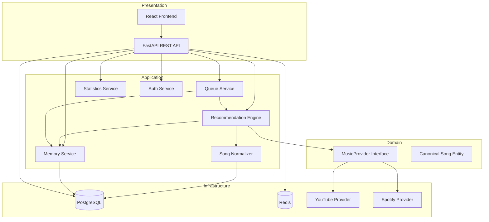
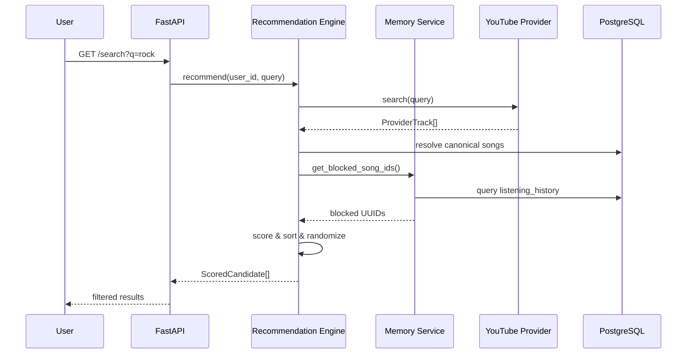
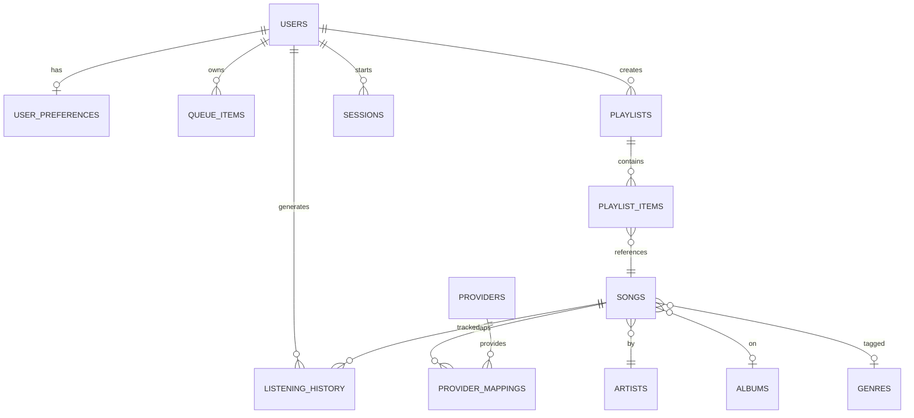
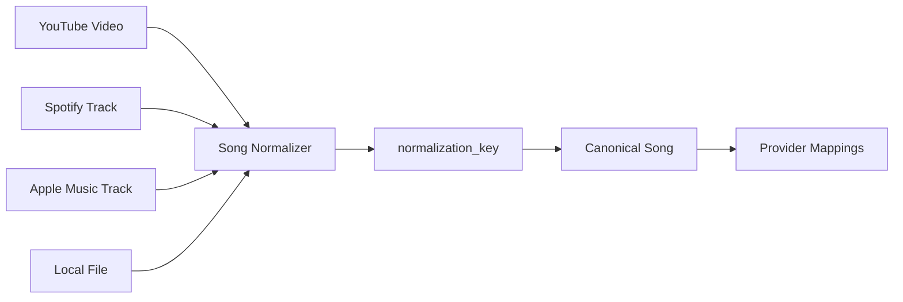
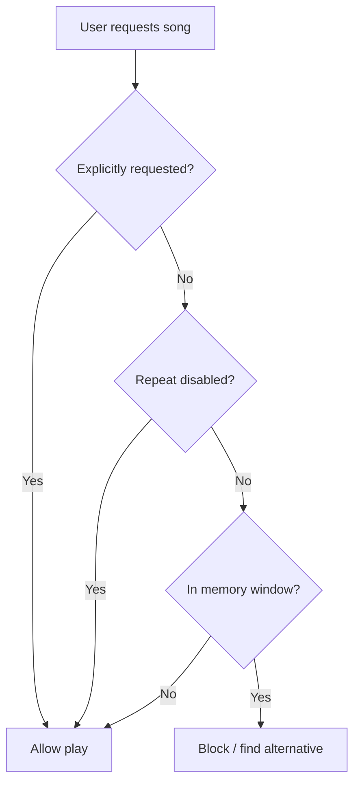
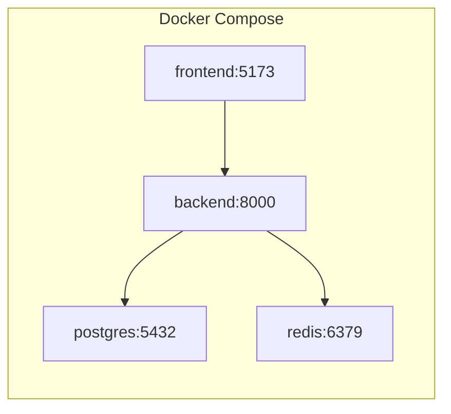

# NoRepeat Architecture

## System Overview



## Recommendation Pipeline



## Entity Relationship Diagram



## Cross-Provider Song Normalization



Normalization key: `SHA256(normalize(artist) | normalize(title) | duration_bucket)`

Future: ISRC, MusicBrainz ID, audio fingerprint hash.

## Memory Window Logic



## Clean Architecture Layers

| Layer          | Responsibility                          | Examples                          |
|----------------|-----------------------------------------|-----------------------------------|
| Presentation   | HTTP, routing, DTOs                     | `routes.py`, Pydantic schemas     |
| Application    | Use cases, orchestration                | `QueueService`, `RecommendationEngine` |
| Domain         | Business rules, interfaces              | `MusicProvider`, `CanonicalSong`  |
| Infrastructure | External systems                        | PostgreSQL, yt-dlp, JWT             |

## Scoring Formula

```
Score =
  artist_diversity_bonus/penalty +
  genre_diversity_bonus/penalty +
  album_diversity_penalty +
  language_diversity_penalty +
  year_diversity_penalty +
  popularity × weight +
  freshness × weight +
  time_of_day × weight +
  random(0, randomness_weight)
```

All weights configurable per user via `user_preferences.recommendation_weights`.

## Deployment



## Extension Points

1. **New Provider** – Implement `MusicProvider` interface, register in `dependencies.py`
2. **ML Recommendations** – Replace `RecommendationEngine._score_track` with model inference
3. **Fingerprinting** – Populate `SongModel.fingerprint_hash`, match before normalization key
4. **Background Jobs** – Add Celery/ARQ worker for cache warming, MusicBrainz enrichment
